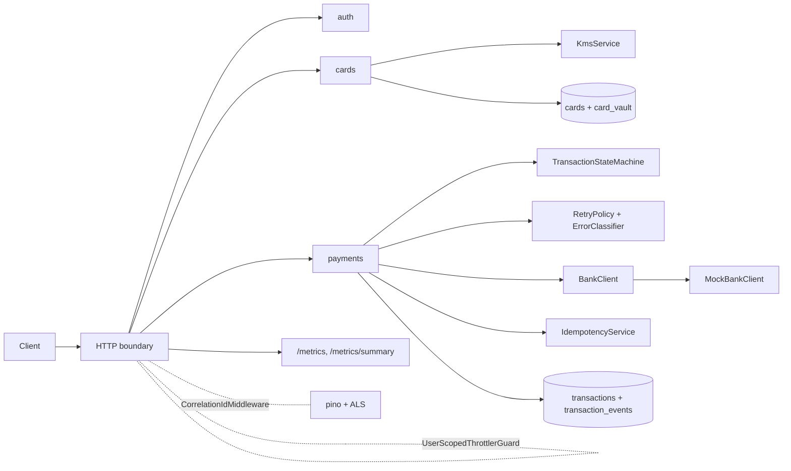
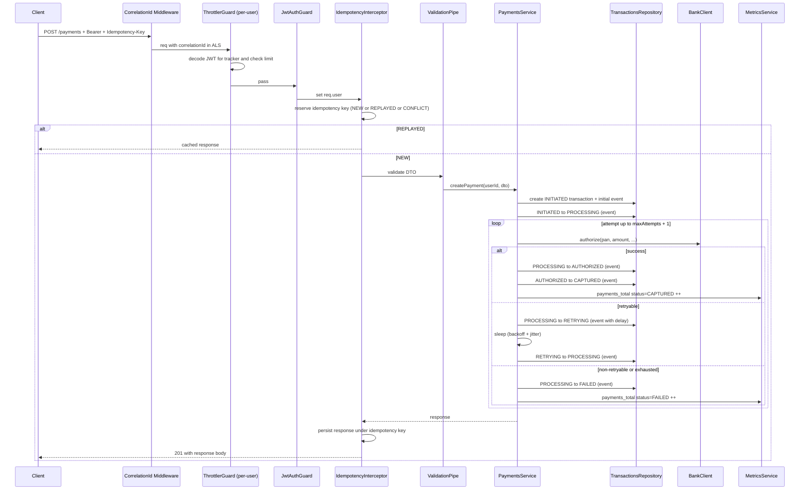
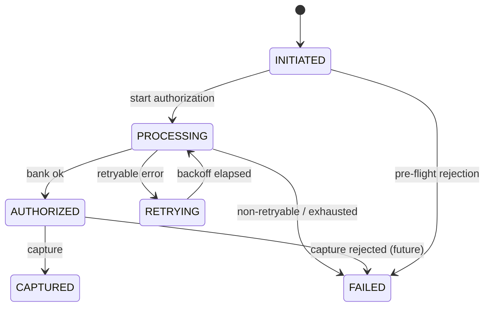

# Architecture

## Layering

Four layers per feature module. The domain layer is plain TypeScript with no
Nest decorators and no Prisma imports, so it can be unit-tested without I/O.

```
HTTP boundary       controllers/        Nest DI, decorators, DTOs
Application         services/           orchestration, transactions, use cases
Domain              domain/             entities, state machine, policies
Infrastructure      infrastructure/     Prisma repositories, adapters, clocks
```

Repositories are abstract classes in `domain/`, bound to Prisma implementations
in `infrastructure/` via Nest DI. The payments service test
([`payments.service.spec.ts`](../src/modules/payments/payments.service.spec.ts))
uses an in-memory `TransactionsRepository` and a `ScriptedBank` instead.

## Module map



## Cross-cutting concerns

- **Correlation ID** lives in an `AsyncLocalStorage` populated by
  `CorrelationIdMiddleware`. Every log line - whether emitted by Nest, pino,
  or our own loggers - carries it as a top-level field. The middleware also
  echoes it back as `X-Correlation-Id`.
- **Global exception filter** (`GlobalExceptionFilter`) maps domain errors to
  HTTP responses with a stable JSON shape: `{ code, message, correlationId,
  details? }`. Unknown fields are pruned; sensitive keys (`pan`, `cvv`,
  `password`, `authorization`, etc.) are never surfaced.
- **Validation**: `ValidationPipe` runs globally with `whitelist: true,
  forbidNonWhitelisted: true`. Every DTO uses `class-validator` constraints.
- **Throttling** is per-user via `UserScopedThrottlerGuard`. Because the
  global throttler guard runs *before* route-level `JwtAuthGuard`, the
  throttler decodes the bearer JWT itself to extract `sub`. Anonymous routes
  fall back to IP.
- **Metrics**: `MetricsService` is a thin wrapper over `prom-client`. The
  same registry powers `/metrics` (Prometheus text) and `/metrics/summary`
  (JSON), so the two views can never disagree.

## Request lifecycle (POST /payments)



## State machine

Allowed transitions, defined in
[`transaction-state-machine.ts`](../src/modules/payments/domain/transaction-state-machine.ts):



Every transition writes a `transaction_events` row in the same Prisma
transaction as the parent update, so the audit log can't drift from state.

## Layout

```
backend/
  prisma/
    schema.prisma
    migrations/
  src/
    main.ts
    app.module.ts
    config/
    common/                # middleware, filters, guards, decorators, errors
    crypto/                # KMS interface + AES-256-GCM impl, token generator
    observability/         # pino logger, metrics service, metrics controller
    prisma/                # Nest module wrapping PrismaClient
    modules/
      auth/                # registration, login, refresh, JWT strategy
      cards/               # add/list/delete cards, Luhn, brand
      bank/                # BankClient interface, MockBankClient, errors
      payments/            # state machine, retry, error classifier,
                           # service, controller
      idempotency/         # interceptor + service + DB record
      rate-limit/          # ThrottlerModule wrapper + user-scoped guard
  test/                    # e2e specs + helpers
  docs/
```
